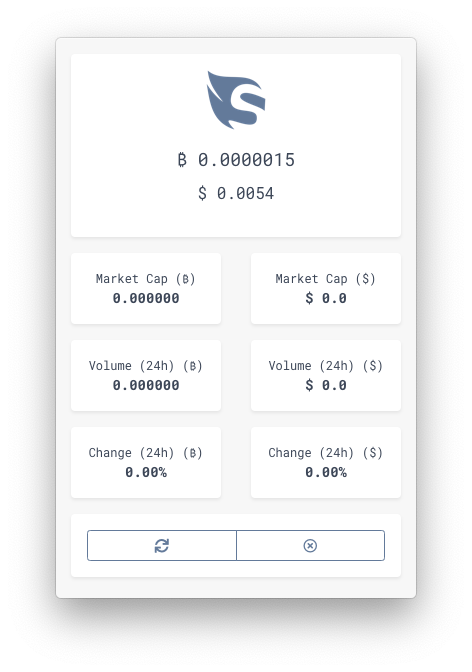
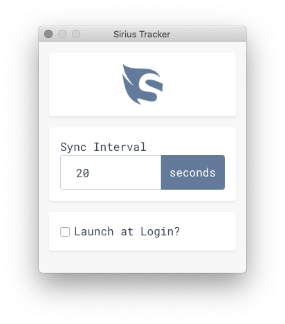
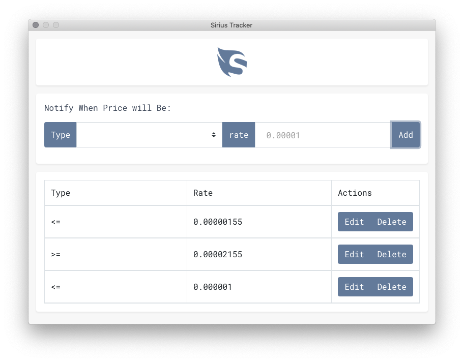

# SiriusTracker

**SiriusTracker** is an open source app for track [Sirius](https://getsirius.io) market information.

The app displays Sirius market information in Bitcoin (BTC) and United States Dollar (USD).

|                 Preferences                  |                 Notifications                  |
| :------------------------------------------: | :--------------------------------------------: |
|  |  |

## Installation

Download released binaries(macOS/Windows/Linux) [here](https://github.com/demartini/SiriusTracker/releases).

## Features

- Built on Electron
- Cross platform
- Clean design
- Completely free

## Contributing

See our [contribution guidelines](./CONTRIBUTING.md) and our [development guide](./DEVELOPMENT.md).

## License

SiriusTracker is released under the **[MIT license](./LICENSE)**

Data provided by [CoinGecko](https://www.coingecko.com).
